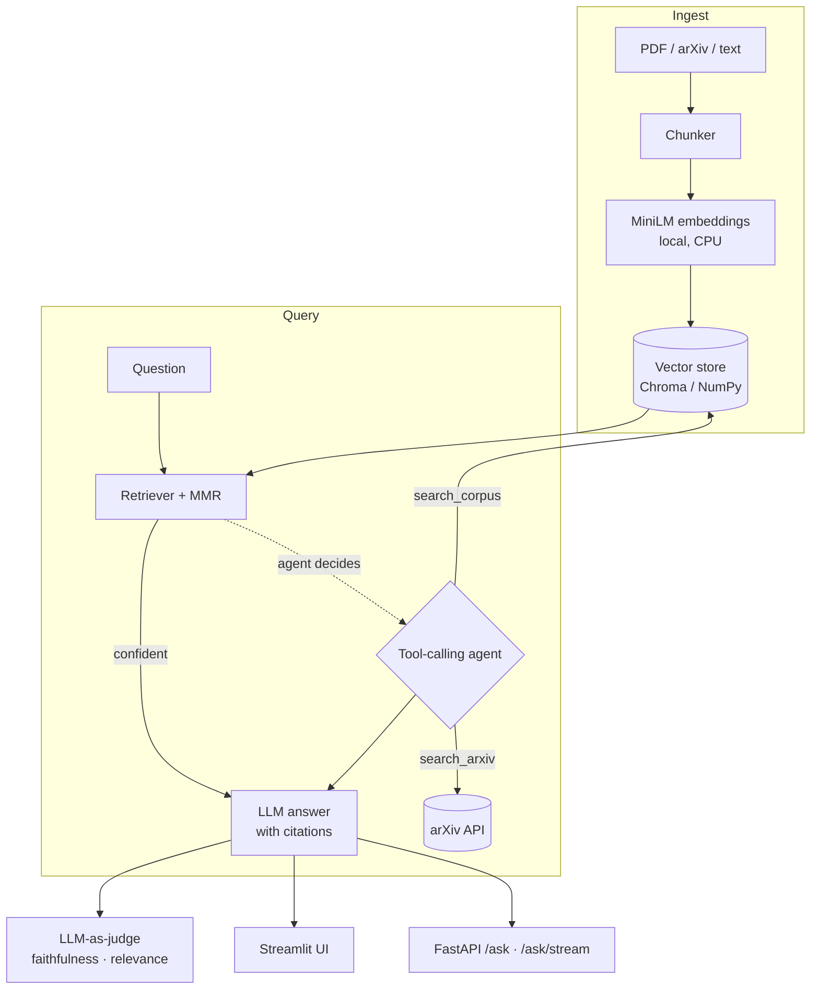

# 📚 ScholarRAG — Agentic RAG Research Assistant

Ask questions across your own library of research papers and get **grounded,
cited answers**. When the local library can't answer, an LLM **agent** decides
to search **arXiv** instead. Every answer can be **scored by an LLM-as-judge**
for faithfulness and relevance — so quality is measured, not assumed.

Built as a compact but production-shaped GenAI system: local embeddings, a
pluggable vector store, retrieval with MMR re-ranking, tool-calling agents,
evaluation, and a streaming API + UI, all containerised.


---

## Why it exists

Most RAG demos stop at "retrieve then generate." ScholarRAG adds the parts that
matter in production:

| Capability | What it demonstrates |
|---|---|
| **Grounded answers with inline `[n]` citations** | Traceability, anti-hallucination |
| **MMR re-ranking** | Retrieval quality beyond naive top-k |
| **Tool-calling agent (corpus ↔ arXiv)** | Function calling / multi-step reasoning |
| **LLM-as-judge evaluation** | Measurable quality: faithfulness, relevance |
| **Streaming FastAPI + Streamlit** | Real serving, not a notebook |
| **Pluggable backends** | ChromaDB with a zero-dependency NumPy fallback |
| **Provider-agnostic LLM** | Groq (free), OpenAI, or a local server via `.env` |

---

## Architecture



---

## Quickstart

```bash
# 1. install (editable)
pip install -e ".[dev]"

# 2. configure the LLM — free Groq key: https://console.groq.com/keys
cp .env.example .env        # then paste your GROQ_API_KEY

# 3. build a library (drop PDFs in data/papers, or pull from arXiv)
python scripts/scholar.py fetch-arxiv "capsule networks medical imaging" -n 5
python scripts/scholar.py ingest        # ingests data/papers/*.pdf

# 4. ask
python scripts/scholar.py ask "How do capsule networks improve on CNNs?" --agent --evaluate

# 5. or launch the UI
streamlit run app/ui.py
```

> No GPU required — embeddings run on CPU with `all-MiniLM-L6-v2`. Without an
> LLM key, retrieval still works and the UI shows the retrieved passages.

---

## Usage

### CLI (`scholar` after install, or `python scripts/scholar.py`)

```bash
scholar stats                                   # config + index size
scholar fetch-arxiv "vision transformers" -n 8  # populate from arXiv
scholar ingest data/papers                       # ingest local PDFs
scholar ask "What is dynamic routing?" -k 5      # RAG answer
scholar ask "Latest work on X?" --agent          # agent (may hit arXiv)
scholar eval --dataset eval/qa_dataset.jsonl --out eval/reports/report.json
```

### REST API

```bash
uvicorn app.api:app --reload
```

| Endpoint | Purpose |
|---|---|
| `GET /health` | status, model, index size |
| `POST /ask` | `{question, k, use_agent}` → answer + citations |
| `POST /ask/stream` | Server-Sent Events token stream |
| `POST /ingest` / `POST /ingest/upload` | add documents |
| `POST /evaluate` | answer + LLM-judge scores |

```bash
curl -s localhost:8000/ask -H "content-type: application/json" \
  -d '{"question":"What signals are in WESAD?","use_agent":true}' | jq
```

### Docker

```bash
docker compose up --build     # API on :8000, UI on :8501
```

---

## Evaluation

`scholar eval` runs each question through the pipeline and scores it with an
LLM judge (reference-free), reporting mean **faithfulness**, **answer
relevance**, and **context relevance**, plus a per-item JSON report. This is the
knob you tune chunk size, `top_k`, and prompts against.

```
=== Evaluation report ===
Questions: 5
  faithfulness      0.970
  answer_relevance  0.854
  context_relevance 0.400
```

*(Example run over a pneumonia chest-X-ray corpus with `openai/gpt-oss-120b`. High
faithfulness confirms answers stay grounded; context-relevance is the honest knob
to improve with re-ranking / smaller `top_k`.)*

---

## Project structure

```
scholar-rag/
├── src/scholar_rag/
│   ├── config.py          # env-driven settings
│   ├── chunking.py        # recursive splitter w/ overlap
│   ├── embeddings.py      # MiniLM + offline hashing fallback
│   ├── vector_store.py    # Chroma + NumPy backends (one interface)
│   ├── ingestion.py       # PDF/text -> chunks -> index
│   ├── retriever.py       # similarity search + MMR
│   ├── rag.py             # retrieve -> prompt -> cited answer
│   ├── agent.py           # tool-calling agent (corpus + arXiv)
│   ├── evaluation.py      # LLM-as-judge metrics
│   ├── llm.py             # provider-agnostic OpenAI-compatible client
│   ├── tools/             # arxiv_search + tool registry
│   └── cli.py             # ingest / fetch-arxiv / ask / eval / stats
├── app/                   # api.py (FastAPI) · ui.py (Streamlit)
├── scripts/scholar.py     # no-install CLI entry
├── tests/                 # pytest (offline, no key needed)
├── eval/qa_dataset.jsonl  # sample evaluation set
├── Dockerfile · docker-compose.yml · Makefile · pyproject.toml
```

---

## Tech stack

**Python 3.12** · **sentence-transformers** (MiniLM) · **ChromaDB** ·
**OpenAI-compatible LLM** (Groq / OpenAI / local) · **FastAPI** (SSE streaming) ·
**Streamlit** · **pydantic** · **pytest** · **Docker**.

## Deploy (Streamlit Community Cloud)

1. Push this repo to GitHub.
2. Go to [share.streamlit.io](https://share.streamlit.io) → sign in with GitHub → **New app**.
3. Select this repo, branch `main`, main file `app/ui.py`.
4. Under **Advanced settings → Secrets**, paste:
   ```toml
   GROQ_API_KEY = "your_groq_key"
   LLM_MODEL = "openai/gpt-oss-120b"
   ```
5. **Deploy.** The app boots with an empty library — use the sidebar to fetch from arXiv or upload PDFs.

> Secrets live only in the Streamlit dashboard, never in the repo. `.env` and `.streamlit/secrets.toml` are git-ignored.

## Roadmap

- Cross-encoder re-ranking stage
- Hybrid (BM25 + dense) retrieval
- Conversational memory / follow-ups
- Ragas integration alongside the built-in judge
